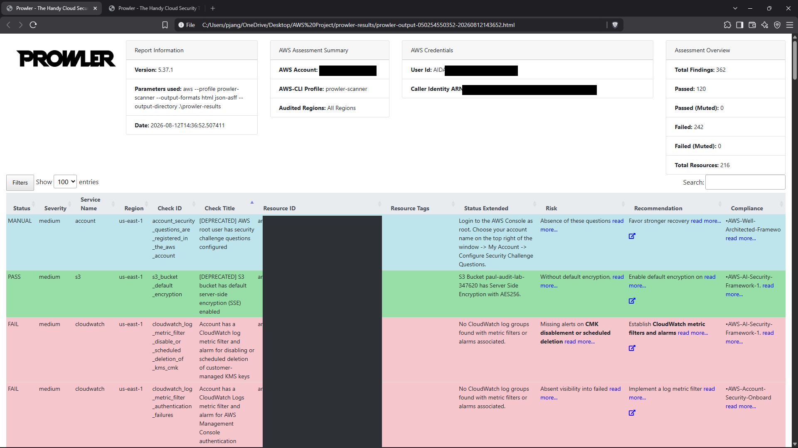
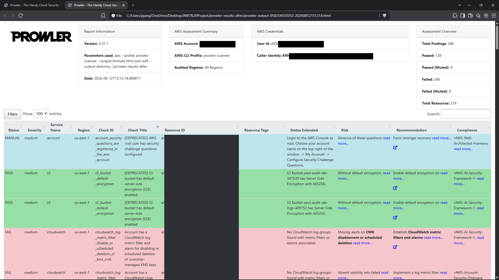
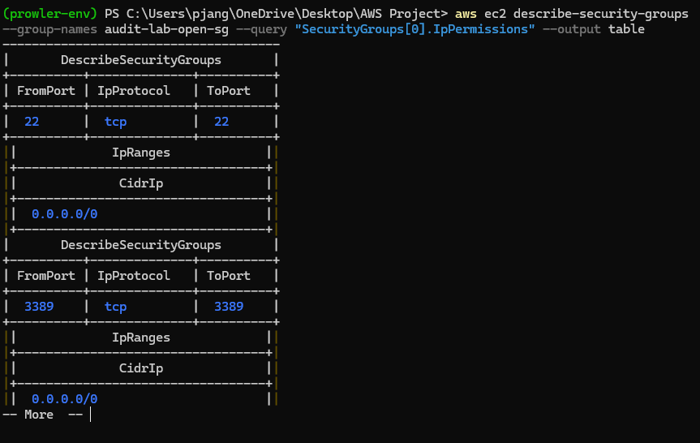
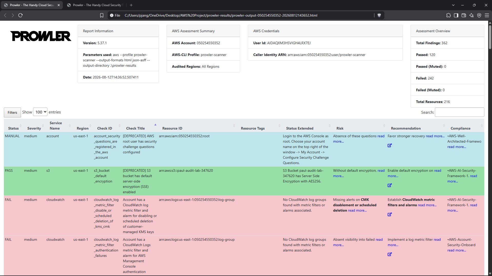
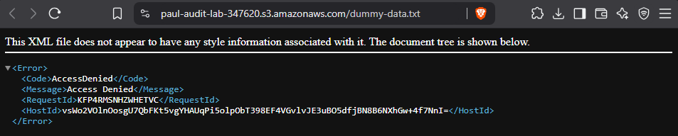

# AWS Cloud Security Audit — Detection & Remediation with Prowler

A hands-on cloud security audit: I deployed a deliberately misconfigured AWS environment, audited it with [Prowler](https://github.com/prowler-cloud/prowler) against the CIS AWS Foundations Benchmark, remediated the findings following least-privilege and defense-in-depth principles, and verified every fix with a second scan.

**Skills demonstrated:** cloud security auditing · AWS IAM/S3/EC2/CloudTrail · misconfiguration remediation · CIS benchmark compliance · least-privilege access design · automated vs. manual verification

---

## Overview

| | |
|---|---|
| **Cloud** | AWS (Free Tier) |
| **Audit tool** | Prowler 5.37.1 |
| **Benchmark** | CIS AWS Foundations |
| **Scope** | Single account, `us-east-1` |
| **Simulated misconfigurations** | 5 |
| **Fully remediated & verified** | 3 |
| **Documented limitation / manual finding** | 2 |

---

## Architecture

```
┌─────────────────────────────────────────────────────────┐
│                    AWS Account (Free Tier)               │
│                                                          │
│   ┌────────────┐   ┌────────────┐   ┌────────────────┐   │
│   │  S3 Bucket │   │  IAM Role  │   │ Security Group │   │
│   │ (public)   │   │ (admin)    │   │ (22/3389 open) │   │
│   └────────────┘   └────────────┘   └────────────────┘   │
│   ┌────────────┐   ┌────────────┐                        │
│   │ EBS Volume │   │ CloudTrail │                        │
│   │(unencrypted)   │ (disabled) │                        │
│   └────────────┘   └────────────┘                        │
└────────────────────────┬─────────────────────────────────┘
                         │
                         │  read-only scan
                         │  (SecurityAudit + ViewOnlyAccess)
                         ▼
                  ┌──────────────┐
                  │   Prowler    │  ── HTML + JSON-ASFF reports
                  │ (least-priv  │
                  │  scanner)    │
                  └──────────────┘
```

Prowler runs under a dedicated, read-only IAM user (`prowler-scanner`) with only the `SecurityAudit` and `ViewOnlyAccess` managed policies attached — the scanner never has permission to modify the account it audits.

---

## Results at a glance

| | Before | After |
|---|---|---|
| **Total checks** | 362 | 386¹ |
| **Passed** | 120 | 138 |
| **Failed** | 242 | 248¹ |
| **Critical failures** | 5 | 4 |

¹ The total check count *rises* after remediation because enabling CloudTrail made ~24 additional checks evaluable that Prowler could not assess when no trail existed (e.g. log-file validation, KMS-at-rest on trail logs). See the [full report](reports/report.md) for detail.


*Prowler summary dashboard (before remediation)*


*Prowler summary dashboard (after remediation)*

---

## Findings & remediation

| # | Finding | Severity | Status | Fix |
|---|---|---|---|---|
| 1 | S3 bucket publicly readable | Critical | ✅ Remediated | Deleted public bucket policy; re-enabled account/bucket Block Public Access |
| 2 | IAM role with `AdministratorAccess` | Critical | ✅ Remediated | Detached admin policy; attached scoped `AmazonS3ReadOnlyAccess` |
| 3 | CloudTrail not enabled | High | ✅ Remediated | Created + started a trail with a dedicated, permission-scoped log bucket |
| 4 | EBS volume unencrypted | Medium | 📝 Documented | AWS does not support in-place encryption of an existing volume; remediation path documented |
| 5 | Security group open to `0.0.0.0/0` on 22/3389 | Critical | 📝 Manual | Not surfaced by the automated scan (unattached group); confirmed via manual verification, then revoked |

### Highlight: public S3 bucket → locked down

Before — the "sensitive" test object was reachable by anyone on the internet:



After — the same URL returns `AccessDenied`:



### Highlight: the scanner's blind spot

Prowler did **not** flag the open security group, because the group was not attached to a running resource at scan time — so it wasn't counted as live attack surface. Manual verification confirmed the exposure the automated tool missed:



This is the single most valuable finding in the project: it shows automated scanning and manual review are complementary, not interchangeable.

---

## Repo structure

```
aws-cloud-security-audit/
├── README.md
├── reports/
│   └── report.md                  # full audit writeup
└── evidence/
    ├── screenshots/               # before/after visual evidence
    └── prowler-reports/           # raw Prowler HTML + JSON output
```

---

## Reproducing this audit

Full step-by-step (Windows/PowerShell) is in [`reports/report.md`](reports/report.md). In brief:

```bash
# scanner runs under a read-only IAM user
pip install prowler
prowler aws --profile prowler-scanner --output-formats html json-asff --output-directory ./prowler-results
```

---

## Key takeaways

- **Automated tools are a starting point, not the whole picture.** A misconfigured but unattached resource slipped past the scanner entirely — manual review caught it.
- **Remediation should be verified, not assumed.** Every fix was confirmed with a second scan rather than treated as done once the command returned.
- **Least privilege applies to your tooling too.** The audit itself was run with a read-only identity that could never alter the account.

---

*This is a personal lab exercise built for learning and portfolio purposes. All "sensitive" data was synthetic, and all resources were torn down after the audit.*
